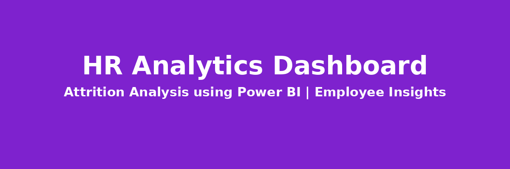
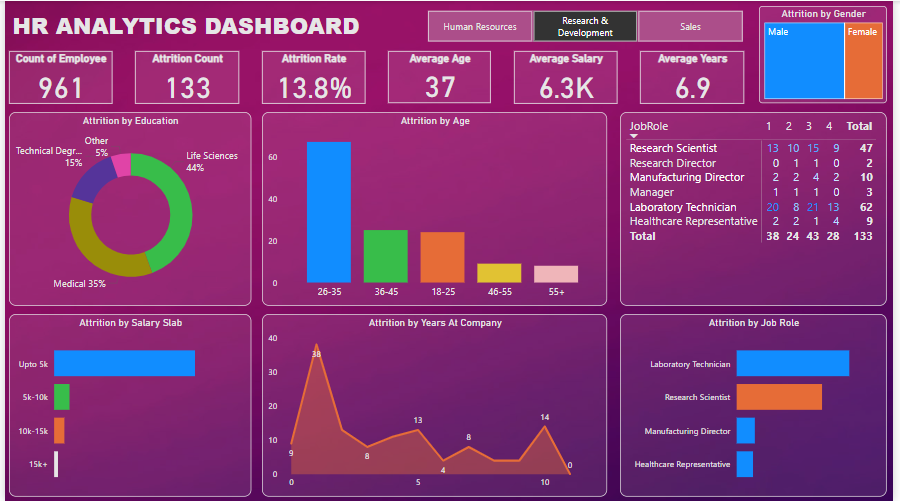

# 🧠 HR Analytics Dashboard (Power BI)

## 📌 Project Objective
This project leverages Power BI to analyze employee attrition within an organization. The dashboard identifies trends and patterns across demographics, education, job roles, and salary brackets, empowering HR teams to make data-driven decisions that improve employee retention and workforce planning.

## 📊 Dashboard Overview


The dashboard includes:
- Key HR metrics: Total Employees, Attrition Count, Attrition Rate, Average Age, Salary, and Tenure
- Breakdown of attrition by:
  - **Age Group**
  - **Gender**
  - **Education Background**
  - **Salary Slab**
  - **Years at Company**
  - **Job Role**
- Interactive department filter (e.g., Human Resources, R&D, Sales)

## 🗂️ Dataset Description
The dataset includes employee-level details such as:
- Age, Gender, Education Field
- Job Role and Department
- Salary Range and Experience
- Attrition Status

## 🔍 Analysis Performed
- **Data Cleaning**: Removed nulls, standardized salary slabs, converted categorical variables.
- **Exploratory Data Analysis (EDA)**: Visualized attrition patterns across dimensions using Power BI visuals.
- **KPI Calculation**: Computed attrition rate, average age, average salary, and average tenure.
- **Segmentation**: Filtered insights by departments and job roles to highlight specific pain points.

## 💡 Key Insights
- The overall attrition rate stands at **13.8%**.
- **26–35 age group** shows the highest attrition, indicating challenges with retaining younger employees.
- Employees with **Medical (35%)** and **Life Sciences (44%)** education have the highest attrition rates.
- **Research Scientists** and **Laboratory Technicians** have the most attrition cases.
- Employees with **up to 5K salary** are most likely to leave, highlighting a potential compensation concern.
- **Attrition drops significantly** after 3+ years with the company.

## 🎯 Conclusion
This HR Analytics Dashboard serves as a strategic tool for human resource managers and analysts. By uncovering key attrition patterns, it enables the creation of targeted retention initiatives, helps identify at-risk groups, and supports data-backed workforce planning.

## 📁 Repository Structure
```
📦 HR-Analytics-Dashboard
├── 📊 HR_Analytics.csv
├── 📷 Screenshot.png
├── 📘 README.md
```